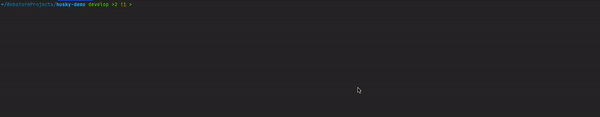

<div align="center">
    <h1>Husky Demo</h1>
    <p>Simple integration of Husky for pre-commit hooks, linting, and formatting. Showcased in a simple Angular project.</p>
</div>

---

## Getting Started

### Prerequisites

- [Node.js](https://nodejs.org/en/)
- [Angular CLI](https://cli.angular.io/)

## Setting up Husky

### Install Husky

```bash
npm install --save-dev husky
npx husky install
```

### Add pre-commit hook

```bash
npx husky add .husky/pre-commit "npm run lint"
```

## Result

When trying to commit, the pre-commit hook will build, test and lint the code. If there are any errors, the commit will be aborted.

<div align="center">
    
</div>

## References

- [Presentation TechTalk](static/Husky%20Techtalk.pptx)
- [Youtube video from Angular Nation](https://www.youtube.com/watch?v=FvfAXG92UqY&ab_channel=AngularNation)
